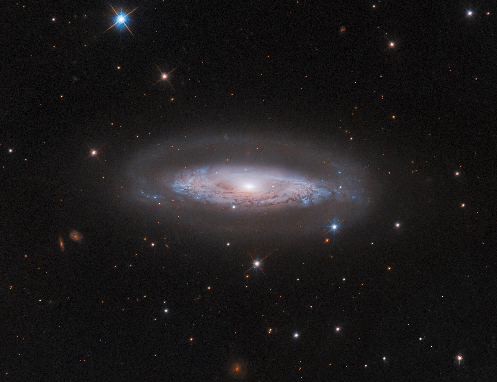

Welcome to the devblog of Project Cosmos!

<figure>

  <figcaption style="font-size: 10px">Image Credit: ESA/Hubble & NASA, M. Koss, A, Barth</figcaption>
</figure>

Embark on an epic journey of exploration, discovery, and innovation in a stunning representation of the cosmos. Inspired by the beauty of the Milky Way, Project Cosmos combines science, strategy, and creativity to deliver a unique space simulation experience.

The website is currently under construction. Stay tuned for updates, sneak peeks, and the latest news about development progress!

In the meantime checkout the [Blog](blog/blog.md) page for the latest devblog updates.

Read the [Website](website.md) section to learn how Project Cosmos started.